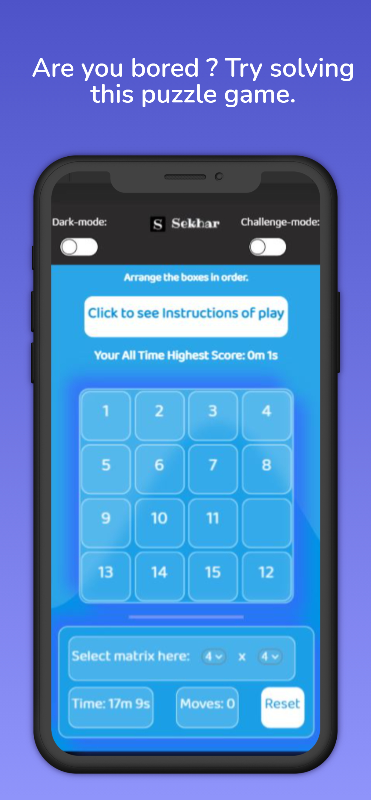
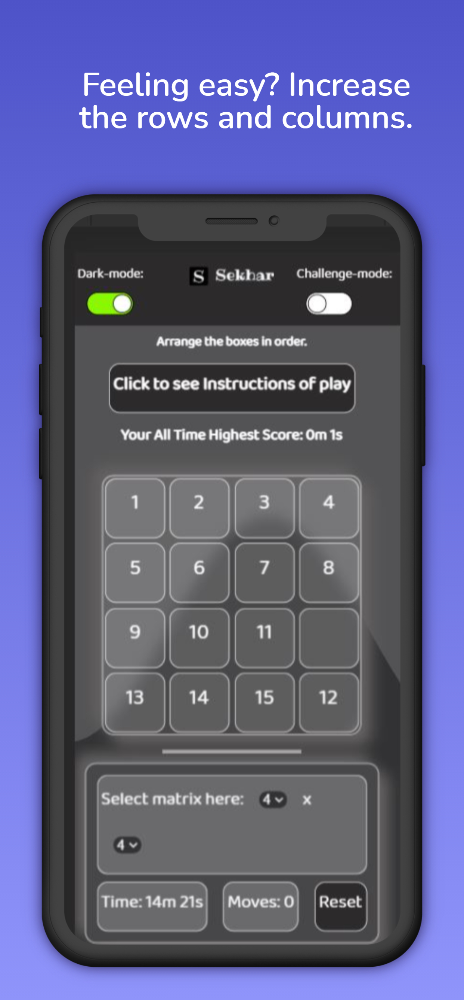

    
# MxN Puzzle

A  MxN Puzzle by a beginner in web develoopment

## License

[MIT](https://choosealicense.com/licenses/mit/)

  
## Authors

- Deep Sekhar Ghosh

  
## Documentation

INSTRUCTIONS:

    1.Click on boxes having the blank box in its row or column
    2.Doing this  will shift the blank box to that  position
    3.Like this shift all the boxes to arrange them  in order starting with 
    box numbered 1 on top left , 2 beside it and so on ..
    
    Best of luck!

CHALLENGE MODE:
        
    In this mode random boxes are blocked for 5secs
    Like box 10 is blocked for first 6sec
    Then box 12 is blocked for next 6 sec.

  
## Features

- Light/dark mode toggle
- Scores stored in local storage
- Challenge mode
- Cross platform

  
## Screenshots
Mockups by reviewed -->https://previewed.app
<!-- 
 -->

<!--  -->
<!--  -->
<table>
  <tr>
    <td >Light Mode</td>
     <td>Dark Mode</td>
  </tr>
  <tr>
    <td></td>
    <td></td>
  </tr>
 </table>

## Badges

  